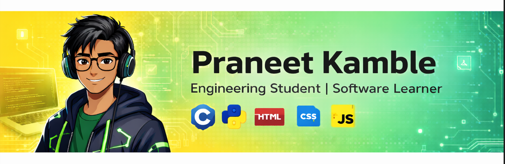

## Hey! 👋

I'm **Praneet Kamble**, an Engineering Student passionate about programming and technology.

- 🎓 Engineering Student  
- 💻 Comfortable with **C**
- 🐍 Python | 🌐 HTML & CSS
- 🌱 Currently learning **JavaScript**

---

## 📚 I'm Currently Learning

- JavaScript fundamentals
- Web development basics
- Data structures (beginner level)

---

## 🚀 About Me

- Interested in **Linux**, **AI**, and **Backend Development**
- Love building small projects to learn better
- Focused on strong fundamentals

---

⭐ Thanks for visiting my profile!

<!--
**praneetkamble/praneetkamble** is a ✨ _special_ ✨ repository because its `README.md` (this file) appears on your GitHub profile.

Here are some ideas to get you started:

- 🔭 I’m currently working on ...
- 🌱 I’m currently learning ...
- 👯 I’m looking to collaborate on ...
- 🤔 I’m looking for help with ...
- 💬 Ask me about ...
- 📫 How to reach me: ...
- 😄 Pronouns: ...
- ⚡ Fun fact: ...
-->
