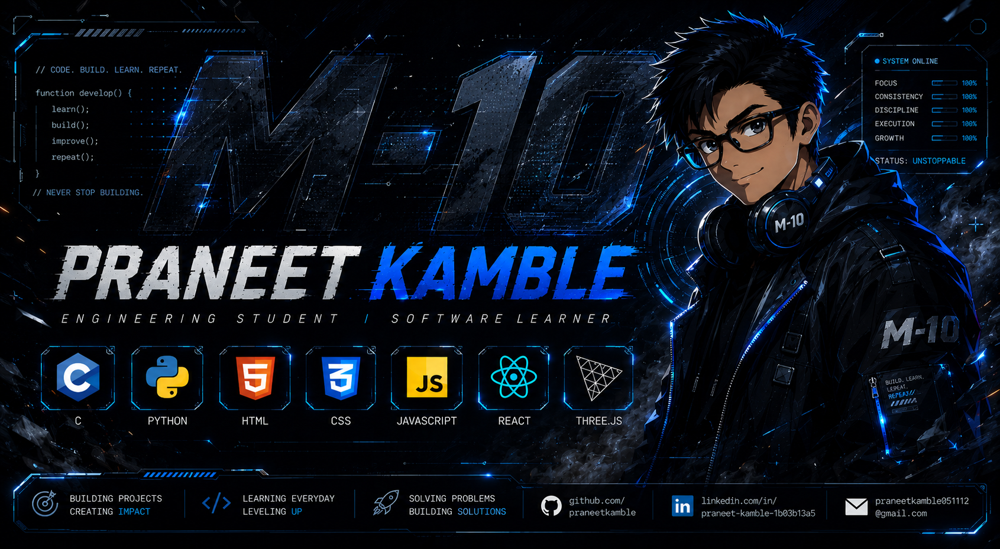

<h1 align="center">⚡ M10 // PRANEET KAMBLE ⚡</h1>

<h3 align="center">
Software Developer • Frontend Engineer • Creative Technologist
</h3>

<p align="center">

</p>

<p align="center">


</p>

---

# ⚡ SYSTEM STATUS

```yaml
Name: Praneet Kamble

Codename: M10

Status: ONLINE

Role:
  - Software Developer
  - Engineering Student

Current Focus:
  - React.js
  - Three.js
  - Advanced JavaScript
  - Modern UI/UX

Interests:
  - Frontend Development
  - AI
  - Linux
  - Backend Development

Mission:
  Transform ideas into immersive digital experiences.

Mode:
  BUILD • LEARN • CREATE • REPEAT
```

---

# 🛠 TECH ARSENAL

<p align="center">

</p>

---

# 📊 DEVELOPMENT ANALYTICS

<p align="center">

</p>

<p align="center">


</p>

<p align="center">

</p>

---

# 📈 CONTRIBUTION ACTIVITY

<p align="center">

</p>

---

# 🚀 FEATURED PROJECTS

<p align="center">

<a href="https://github.com/praneetkamble">

</a>

<a href="https://github.com/praneetkamble">

</a>

</p>

<p align="center">

<a href="https://github.com/praneetkamble">

</a>

<a href="https://github.com/praneetkamble">

</a>

</p>

---

# 🎯 CURRENT MISSION

```text
[█████████░] React.js

[███████░░░] Three.js

[████████░░] Frontend Development

[██████░░░░] Backend Development

[███████░░░] Data Structures & Algorithms
```

---

# 🏆 ACHIEVEMENTS

```diff
+ Building Modern Web Applications
+ Learning React Ecosystem
+ Exploring Three.js
+ UI/UX Enthusiast
+ Continuous Learner
+ Future Full Stack Developer
```

---

# 🌐 CONNECT

<p align="center">

<a href="https://github.com/praneetkamble">

</a>

<a href="https://www.linkedin.com/in/praneet-kamble-1b03b13a5/">

</a>

<a href="mailto:praneetkamble051112@gmail.com">

</a>

</p>

---

<p align="center">

</p>

<h2 align="center">
⚡ M10 • BUILD • LEARN • CREATE • REPEAT ⚡
</h2>

<p align="center">
Turning Ideas Into Reality 🚀
</p>
